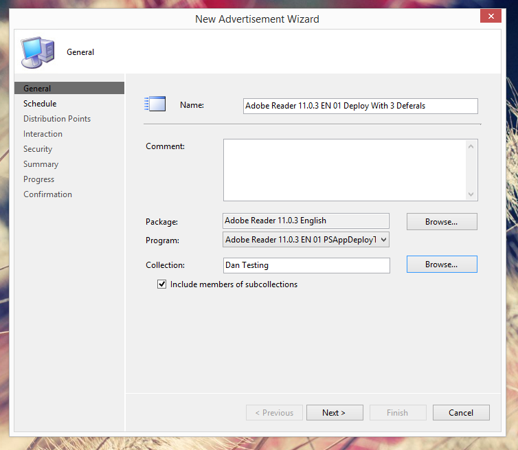
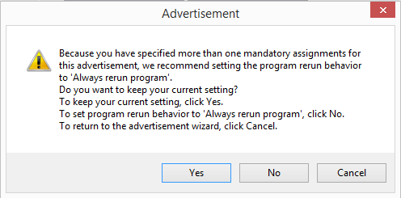

### Deploy the Adobe Reader installation using SCCM 2007 or SCCM 2012 package

  - Copy the installation files to a network location accessible by SCCM.

  - Create a new Package:

  - Set the package source folder accordingly:

  - Accept the defaults for the rest of the package (or modify according to your environment)

  - Distribute the content of the package to the relevant Distribution Points

  - Create a new Program for the package:

  - Accept the defaults for the requirements of the program (or modify according to your environment)

  - On the Environment page, ensure you use a combination of settings that allows the user to interact with the application. Failure to do so will result in the application installing silently:

  - Accept the defaults for the rest of the program (or modify according to your environment)

  - Create a new Advertisement for the Package and set your target collection accordingly:

  - Set a recurring schedule for the Mandatory Assignment. This dictates how frequently the application should attempt to install. Additionally, ensure that “Rerun if failed previous attempt” is enabled. These settings are required when using the deferral system and ensure that if a user defers the install, the install will retry after the specified interval:

  - When prompted with the following dialog box, select Yes:

  - Accept the defaults for the rest of the advertisement (or modify according to your environment). The deployment should start on your target machines shortly.
