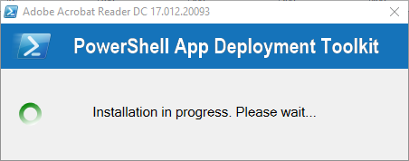
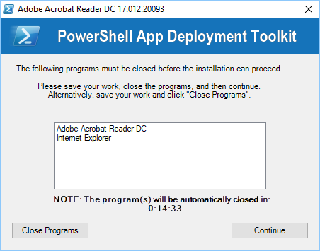
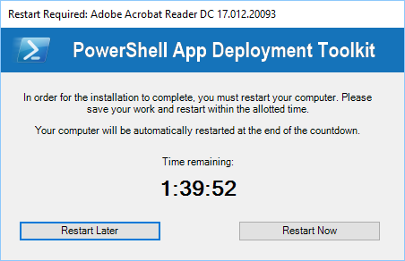

## Toolkit File Structure

### Files

The toolkit is comprised of the following files:

`Deploy-Application.ps1`

Performs the actual install / uninstall and is the only file that needs to be modified, depending on your level of customisation.

`Deploy-Application.exe`

An optional executable that can be used to launch the Deploy-Application.ps1 script without opening a PowerShell console window. Supports passing command-line parameters to the script.

`AppDeployToolkitMain.ps1`

Contains all of the functions and logic used by the installation script. By Separating the logic from the installation script, we can obfuscate away the complex code and make enhancements independently of the installation scripts that contain per-application actions.

`AppDeployToolkitConfig.xml`

Contains configurable options referenced by the AppDeployToolkitMain.ps1 script, such as MSI switches and User Interface messages, which are customizable and localized in several languages. This is intended to be a static file that is configured once, not on a per-application basis.

`AppDeployToolkitExtensions.ps1`

This is an optional PowerShell script that can be used to extend the toolkit functionality with custom functions. It is automatically dot-sourced by the AppDeployToolkitMain.ps1 script.

`AppDeployToolkitHelp.ps1`

This is a script that displays a help console to browse the functions included in the Toolkit and copy and paste examples in to your deployment script.

### Directories

The Root folder contains the Deploy-Application.exe and Deploy-Application.ps1 files. The Deploy-Application.ps1 file is the only file that should be modified on a per-application basis.

The directories below contain the installation files and supporting files referenced by the toolkit.

`AppDeployToolkit`

Folder containing the toolkit dependency files.

`Files`

Folder containing your main setup files, e.g. MSI

`SupportFiles`

Folder containing any supporting files such as files you need to copy to the target machine using the toolkit during deployment.

## Toolkit User Interface

The user interface consists of several components detailed below. The user interface can be branded with a custom logo and banner.

All of the UI components include message text that is customizable in the AppDeployToolkitConfig.xml. The UI has been localised in 11 different languages: English, French, Spanish, Portuguese, German, Italian, Dutch, Swedish, Danish, Norweigan and Japanese. Additional languages can be easily added in the XML configuration file.

The language used by the Toolkit UI is selected automatically based on the language culture of the operating system, so the same AppDeployToolkitConfig file can be used in a multi-language environment.

The user interface can be suppressed by specifying the deploy mode parameter as follows:

`Deploy-Application.ps1 -DeployMode "Silent"`

### Installation Progress

The installation progress message displays an indeterminate progress ring to indicate an installation is in progress and display status messages to the end user. This is invoked using the “Show-InstallationProgress” function.

The progress message can be dynamically updated to indicate the stage of the installation or to display custom messages to the user, using the “Show-InstallationProgress” function.

### Installation Welcome Prompt

The application welcome prompt can be used to display applications that need to be closed, an option to defer and a countdown to closing applications automatically. Use the “Show-InstallationWelcome” function to display the prompts shown below.

Welcome prompt with close programs option and defer option:

Welcome prompt with close programs options and countdown to automatic closing of applications:

Welcome prompt with just a defer option:

### Block Application Execution

If the block execution option is enabled (see Show-InstallationWelcome function), the user will be prompted that they cannot launch the specified application(s) while the installation is in progress. The application will be unblocked again once the installation has completed.

### Disk Space Requirements

If the CheckDiskSpace parameter is used with the Show-InstallationWelcome function and the disk space requirements are not met, the following prompt will be displayed and the installation will not proceed.

### Custom Installation Prompt

A custom prompt with the toolkit branding can be used to display messages and interact with the user using the “Show-InstallationPrompt” function. The title and text is customizable and up to 3 customizable buttons can be included on the prompt as well as optional system icons, e.g.

Additionally, the prompt can be displayed asynchronously, e.g. to display a message at the end of the installation but allow the installation to return the exit code to the parent process without waiting for the user to respond to the message.

### Installation Restart Prompt

A restart prompt can be displayed with a countdown to automatic restart using the “Show-InstallationRestartPrompt”. Since the restart prompt is executed in a separate PowerShell session, the toolkit will still return the appropriate exit code to the parent process.

### Balloon tip notifications

Balloon tip notifications are displayed in the system tray automatically at the beginning and end of the installation. These can be turned off in the XML configuration.

### Custom Dialog box

A generic dialog box to display custom messages to the user without the toolkit branding using the function “Show-DialogBox”. This can be customized with different system icons and buttons.

## Logging

The toolkit generates extensive logging for all toolkit and MSI operations.

The default log directory for the toolkit and MSI log files can be specified in the XML configuration file. The default directory is `C:\Windows\Logs\Software\`.

The toolkit log file is named after the application with `_PSAppDeployToolkit` appended to the end, e.g.

`Oracle_JavaRuntime_1.7.0.17_EN_01**_PSAppDeployToolkit.log**`

All MSI actions are logged and the log file is named according to the MSI file used on the command line, with the action appended to the log file name. For uninstallations, the MSI product code is resolved to the MSI application name and version to keep the same log file format, e.g.

`Oracle_JavaRuntimeEnvironmentx86_1.7.0.17_EN_01**_Install.log**`
`Oracle_JavaRuntimeEnvironmentx86_1.7.0.17_EN_01**_Repair.log**`
`Oracle_JavaRuntimeEnvironmentx86_1.7.0.17_EN_01**_Patch.log**`
`Oracle_JavaRuntimeEnvironmentx86_1.7.0.17_EN_01**_Uninstall.log**`
